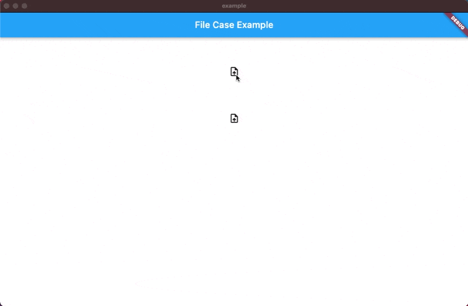

TODO: Put a short description of the package here that helps potential users
know whether this package might be useful for them.

A flutter widget to showcase and process uploaded files on Web, Android, Ios, MacOs, Linux & Windows.


## Features
#

TODO: List what your package can do. Maybe include images, gifs, or videos.

### Web 


### Desktop - MacOs & Windows 


### Mobile - Android & Ios 


### Upcoming Features
#

* File preview 

## Getting started

TODO: List prerequisites and provide or point to information on how to
start using the package.

## Usage

Follow these simple steps to get started with `FileCase`, for detailed example see <a href="https://github.com/asadamatic/file_case/blob/master/example/lib/example.dart" class="special">example</a> folder. 

1. Create an instance of `FileCaseController` and provide a unique string as `tag`

```dart
final FileCaseController firstController = FileCaseController(
      filePickerOptions: FilePickerOptions(type: FileType.any),
      tag: 'controller1');
```

Pass `FilePickerOptions` to customize `pickFiles` functionality from `file_picker`.
For information about FilePickerOptions, hover over the parameters and see the docs.

2. Use the `FileCase` widget in your UI and pass the same `tag` string as for the `FileCaseController` 

```dart
const FileCase(
              tag: 'controller1',
            ),
```

3. Use the `FileUploadIconButton` or `FileUploadButton` in your UI to be able to pick files.
Pass the same `tag` string as for the corresponding `FileCaseController` and `FileCase`.

```dart
const FileUploadIconButton(tag: 'controller1'),

OR

const FileUploadButton(tag: 'controller1'),
```

## Additional information

TODO: Tell users more about the package: where to find more information, how to 
contribute to the package, how to file issues, what response they can expect 
from the package authors, and more.
